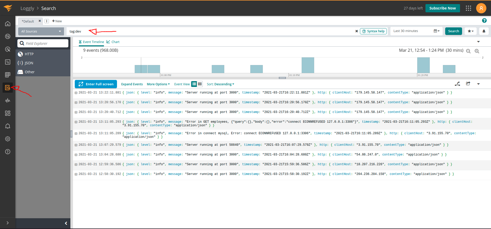
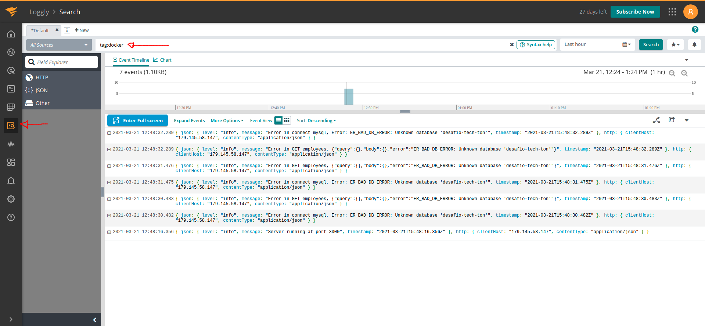
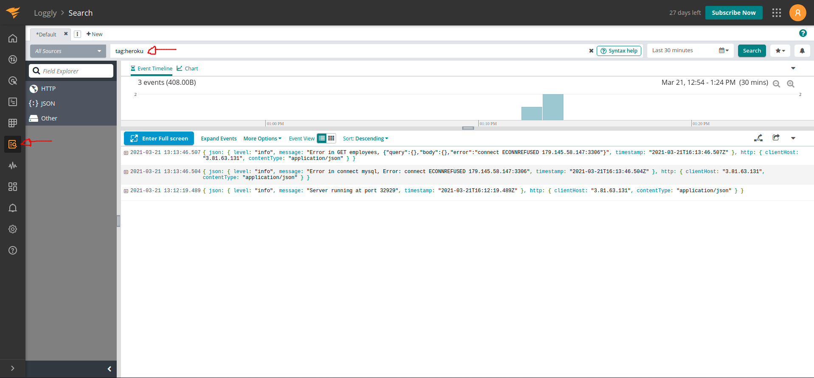
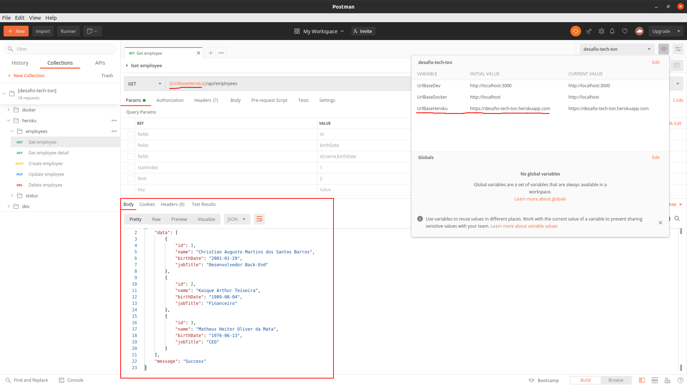
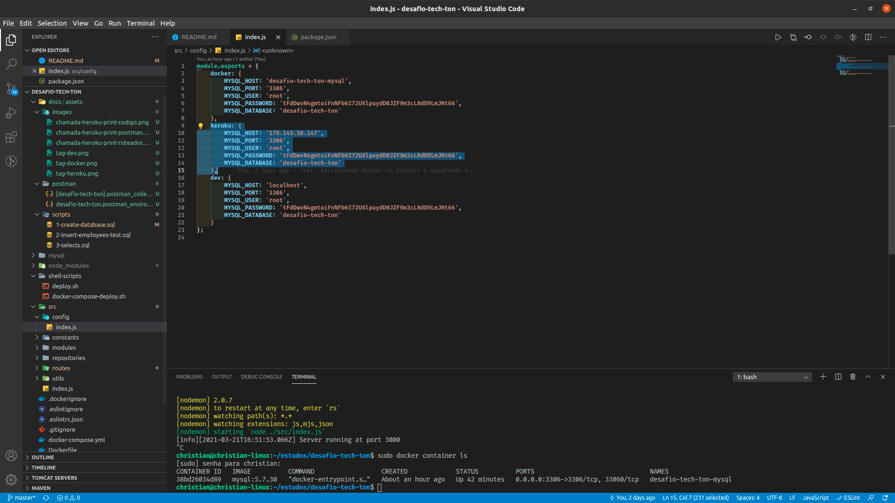
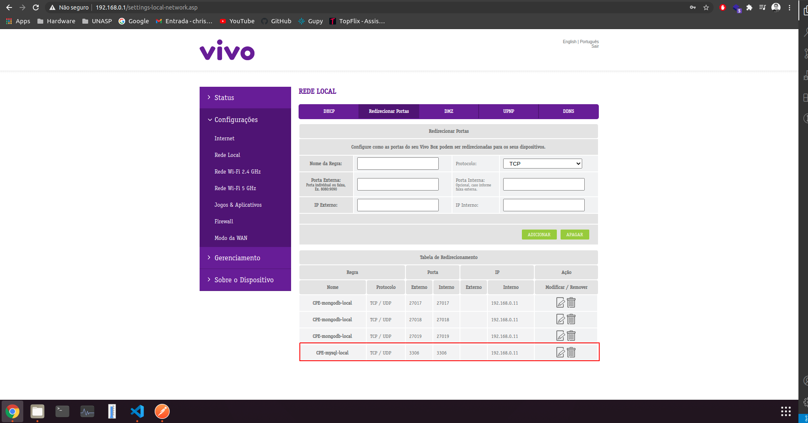

# Desafio tech ton
Teste Back-End para a empresa Stone.

<br/>
<br/>

## Briefing
Esse desafio que propomos é escrever uma API REST, usando Javascript/Node que realizará operações em um banco de dados de funcionários.

**Requisitos**

Um funcionário deve possuir como atributos: Id, Idade, Nome e Cargo

Salvar as informações necessárias em um banco de dados relacional de sua escolha

Gerar logs das ações

Documentar como rodar o projeto


**Operações Desejadas**

Implementar métodos:

1.GET

2.POST

3.PUT

4.DELETE 


O ideal é que a aplicação cumpra todos os requisitos, mas se isso não for possível, gostaríamos de ver o seu código mesmo assim.

**Como submeter a solução**

O código deve estar no Github com o repositório público. Responda esse email com o link do repositório.

Além disso, o projeto precisa ser hospedado em alguma plataforma como o Heroku ou até mesmo AWS.

<br/>
<br/>

## Tecnologias
```
Node.js - v14.16.0
npm     - v6.14.11
```

## Execução Local
Existem duas maneiras de realizar a execução local:

**1: MySQL fora do docker + Node.js fora do docker** <br/>
    Na pasta raiz do repositório execute o seguinte comando:
```
npm start
```
O MySQL precisa estar instalado e configurado seguindo o [script](docs/assets/scripts/1-create-database.sql) antes de acontecer chamadas de API.

**2: MySQL + Node.js usando docker compose** <br/>
    Na pasta raiz do repositório execute o seguinte comando:
```
docker-compose up -d
```
**OBS**: Tomar cuidado com permissões de admin no linux (usar sudo se
necessário). O [script](shell-scripts/deploy.sh) pode ser executado na pasta
raiz do repositório para ajudar na execução em linux (bash ./shell-scripts/deploy.sh). <br/>
O MySQL precisa ser configurado seguindo o [script](docs/assets/scripts/1-create-database.sql) antes de acontecer chamadas de API.

<br/>
<br/>

## Config chamadas de API:
Pode ser usada a [config do postman](docs/assets/postman/[desafio-tech-ton].postman_collection.json)
para testar as requisições. Não esquecer de importar o [environment](docs/assets/postman/desafio-tech-ton.postman_environment.json)
também e, se necessário, configurar as URLs base

<br/>
<br/>

## Acesso aos logs do loggly
Email: desafiotechton@gmail.com <br/>
Senha: sZhqYH5eq*%FHnnJ <br/>
Username: desafiotechton <br/>
Account Name (subdomain): desafiotechton <br/>
Customer token (logs): 223b4daf-7b2c-4299-9bd4-808e3df74577 <br/>
Login:
1. https://www.loggly.com
2. Log in
3. Email e senha acima.

ou
1. https://my.solarwinds.cloud/login?nonce=ump0vPYfZIBtgCGY&state=eyJvcmlnaW5hdGluZ19vcmdfaWQiOiBudWxsLCAicmZwIjogIlRZazV1NGV3cFpIRlFCNksiLCAic3ViZG9tYWluIjogImRlc2FmaW90ZWNodG9uIiwgInJldHVybl9wYXRoIjogIi8ifQ%3D%3D&redirect_uri=https%3A%2F%2Fapp.loggly.com%2Fsso%2Foidc%2Fdo_sign_on&response_type=code&client_id=loggly&scope=openid+swicus
2. Email e senha acima.

Tags:





<br/>
<br/>

## Considerações desenvolvimento
1. Um dos requisitos era postar no heroku ou AWS. Porém, não possuo uma conta
AWS sem ser a do trabalho então resolvi subir no heroku e apontar para meu IP
público e realizar redirecionamento de portas no roteador. O que pode acontecer
é meu IP mudar e não funcionar mais. Então, estou deixando 2 prints aqui da
chamada para o heroku apontando para meu IP.




<br/>
<br/>

## Informação do autor
* :white_check_mark: Nome: Christian Augusto Martins dos Santos Barros
* :white_check_mark: Email: christianbetta@gmail.com
* :white_check_mark: Telefone: (+55) 11 99311-8482
* :white_check_mark: Brasil - São Paulo - SP
